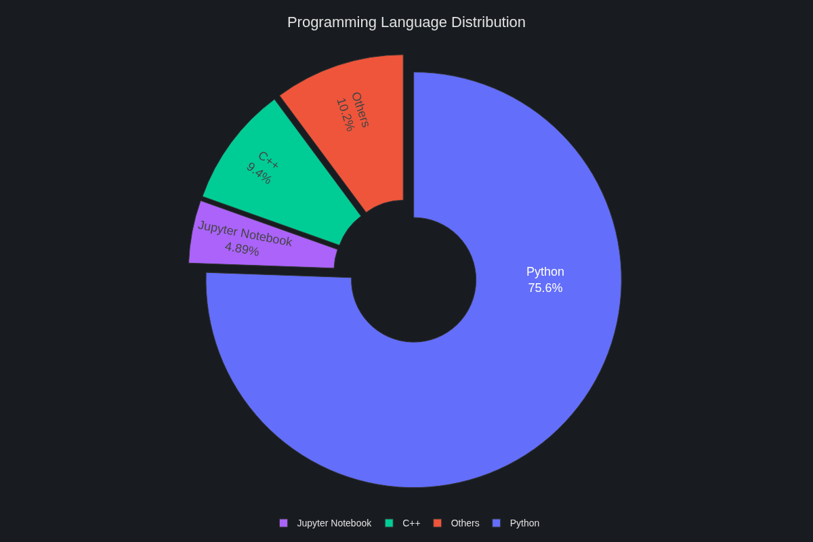
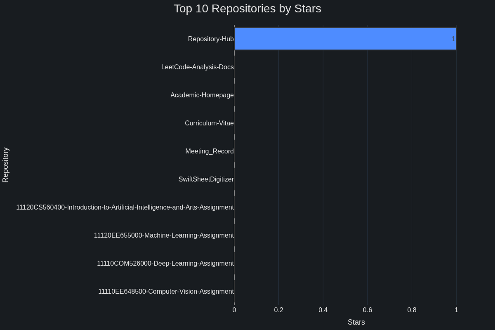
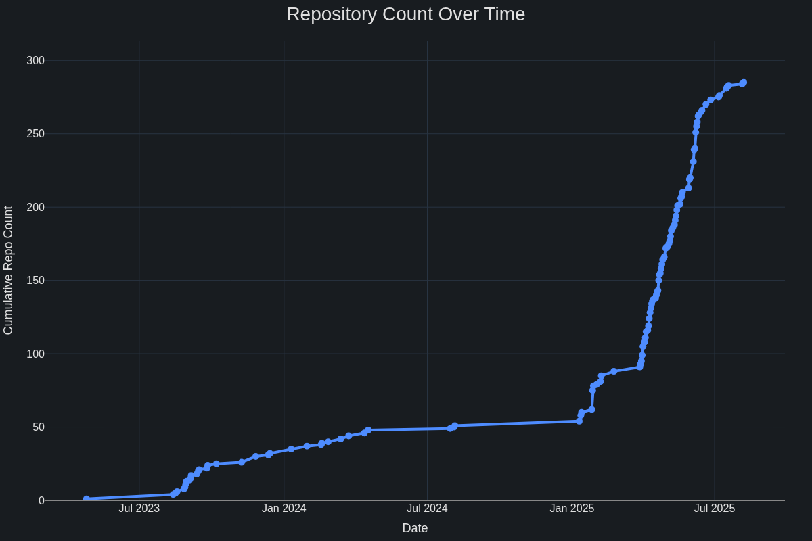
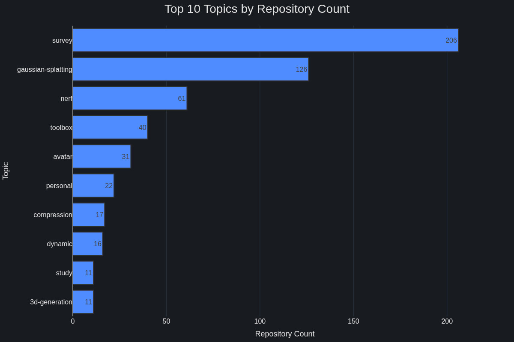

# Repository Hub

**Repository Hub** is a powerful and intuitive tool designed to help developers effortlessly discover, track, and manage their GitHub repositories. Say goodbye to scattered projects and endless searching! With **Repository Hub**, you get a unified, high-level overview of all your projects, making it easier than ever to grasp your codebase, identify key statistics, and quickly navigate to what matters most.

**Repository Hub** automatically aggregates all the GitHub repository information and updates the README daily.

---

## Core Features

* **Comprehensive Repository Overview:** Get an instant, structured view of all your repositories—personal, organizational, private, and public—all in one place.
* **Key Stats at a Glance:** Quickly assess the health and status of each project with immediate access to essential metrics like primary languages, star counts, and last updated times.
* **Intuitive Topic-Based Classification:** Effortlessly pinpoint and organize projects using a clear, categorized table, making it simple to filter by relevant topics.
* **Direct Access:** Seamlessly navigate from this centralized overview straight to any repository on GitHub with a single click.
* **Enhanced Project Discovery:** Easily re-familiarize yourself with older projects or uncover hidden gems across your entire portfolio.

---

## Automated Updates & Aggregated Data

This project ensures your repository list is always up-to-date and comprehensive.

* **Auto-Update Frequency:** The project automatically updates its data **every day at 00:00 (UTC)**.
* **Aggregated Content Includes:**
    * Repository Name
    * Visibility (Public/Private)
    * Description
    * Topics
    * Direct Project Link
    * Primary Language
    * Star Count
    * Last Updated Time
    * ...and more!


## Get Started

### Get your GitHub Personal Access Token

1. Go to [GitHub Settings > Developer settings > Personal access tokens](https://github.com/settings/tokens).
2. Click "Fine-grained token".
3. Click "Generate new token".
4. Set a token name, description, expiration.
5. Select your desired repository access:
    * **Public repositories**
        * Read-only access to public repositories.
    * **All repositories**
        * This applies to all current and future repositories you own. Also includes public repositories (read-only).
    * **Only select repositories**
        * Select at least one repository. Max 50 repositories. Also includes public repositories (read-only).

    If you only want to track public repositories, select **Public repositories**.

    If you want to track both public and private repositories, select **All repositories** or just authorized this repo by selecting **Only select repositories**.
6. Permissions:
    * Set `Repository permissions - Contents` to `Read and Write`.
7. Click "Generate token" at the bottom.
8. Copy the generated token and save it securely (you won't be able to see it again).
9. Use this token as the value for `GH_PAT` in your GitHub repository secrets and local environment variables.

> Warning: Never share your token publicly. Treat it like a password.


### Set up GitHub Actions Automation

1. Go to **Repository Hub** repository page.
2. Click "Settings" → "Secrets and variables" → "Actions".
3. Click "New repository secret".
4. Add a secret named `GH_PAT` with your GitHub Personal Access Token.
    > The Secret Name should be aligned with the configuration in the GitHub workflow file. We named `GH_PAT` in this repo.
5. Click "Add Secret".
6. Go to "Settings" → "Actions" → "General" → "Workflow permissions".
7. Select **Read and write permissions**.
    * Workflows have read and write permissions in the repository for all scopes.
8. Click "Save".
9. Make sure the GitHub Workflow file `.github/workflows/update.yml` exists.
10. The workflow will run automatically every day at 00:00 (UTC), or you can trigger it manually from the Actions page.


### Preview and Update Locally (Optional)

The section describe the steps if you want to update **Repository Hub** locally.


#### 1. Prepare your local environment

- Make sure you have Python 3 installed on your computer. You can check by running:
    ```bash
    python --version
    ```
- (Recommended) Create and activate a Conda environment:
    ```bash
    conda create -n Repository-Hub python=3.10
    conda activate Repository-Hub
    ```
- Install required packages:
    ```bash
    # by pip
    pip install requests plotly kaleido

    # by conda
    conda install -c conda-forge requests plotly kaleido-core -y
    ```

#### 2. Preview the result locally

You can run the script on your own computer to preview the generated README and charts before pushing to GitHub:

- Set environment variables in your terminal (replace with your own values):
    ```bash
    # linux
    export GH_PAT="<your GitHub Personal Access Token>"
    export GITHUB_USERNAME="<your GitHub username>"

    # windows
    $env:GH_PAT="<your GitHub Personal Access Token>"
    $env:GITHUB_USERNAME="<your GitHub username>"
    ```
- Run the script:
    ```bash
    python update_readme.py
    ```
- Check the generated README.md and chart files in your project folder.


---

## GitHub Repository Dashboard

> The aggregated contents are automatically generated by the script and updated in this section.

---

### Repository Information Overview

| Type   | Count |
|--------|-------|
| Total  | 220 |
| Public | 1 |
| Private| 219 |

### Language Distribution Overview

| Language | Count | Percentage |
|---|---|---|
| Python | 175 | 79.5% |
| C++ | 19 | 8.6% |
| Jupyter Notebook | 7 | 3.2% |
| Unknown | 6 | 2.7% |
| HTML | 5 | 2.3% |
| Shell | 3 | 1.4% |
| Ruby | 1 | 0.5% |
| Cuda | 1 | 0.5% |
| Svelte | 1 | 0.5% |
| JavaScript | 1 | 0.5% |
| TypeScript | 1 | 0.5% |



### Top 10 Repositories by Star Count



### Repository Creation Trend



### Top 10 Topics by Repository Count



### Categorized Repository Index

### Unassigned (220)

| Name | Status | Stars | Last Updated | Description | Link |
|---|---|---|---|---|---|
| Repository-Hub | Private | 0 | 2025-05-31 | Repository Hub: The Centralized GitHub Repository Dashboard & Overview. | [🔗](https://github.com/kevin30205/Repository-Hub) |
| GaussianPrediction_survey | Private | 0 | 2025-05-31 | Survey of GaussianPrediction (SIGGRAPH 2024) | [🔗](https://github.com/kevin30205/GaussianPrediction_survey) |
| AdR-Gaussian_survey | Private | 0 | 2025-05-31 | Survey of AdR-Gaussian (SIGGRAPH Asia 2024) | [🔗](https://github.com/kevin30205/AdR-Gaussian_survey) |
| NRHints_survey | Private | 0 | 2025-05-30 | Survey of NRHints (SIGGRAPH 2023) | [🔗](https://github.com/kevin30205/NRHints_survey) |
| GS-3_survey | Private | 0 | 2025-05-30 | Survey of GS^3 (SIGGRAPH Asia 2024) | [🔗](https://github.com/kevin30205/GS-3_survey) |
| CoR-GS_survey | Private | 0 | 2025-05-30 | Survey of CoR-GS (ECCV 2024) | [🔗](https://github.com/kevin30205/CoR-GS_survey) |
| GS-IR_survey | Private | 0 | 2025-05-30 | Survey of GS-IR (arXiv 2023) | [🔗](https://github.com/kevin30205/GS-IR_survey) |
| GI-GS_survey | Private | 0 | 2025-05-30 | Survey of GI-GS (ICLR 2025) | [🔗](https://github.com/kevin30205/GI-GS_survey) |
| SparseGS_survey | Private | 0 | 2025-05-29 | Survey of SparseGS (3DV 2025) | [🔗](https://github.com/kevin30205/SparseGS_survey) |
| HAHA_survey | Private | 0 | 2025-05-29 | Survey of HAHA (ACCV 2024) | [🔗](https://github.com/kevin30205/HAHA_survey) |
| Deformable-Radial-Kernel-Splatting_survey | Private | 0 | 2025-05-29 | Survey of Deformable Radial Kernel Splatting (CVPR 2025) | [🔗](https://github.com/kevin30205/Deformable-Radial-Kernel-Splatting_survey) |
| ControlGS_survey | Private | 0 | 2025-05-29 | Survey of ControlGS (arXiv 2025) | [🔗](https://github.com/kevin30205/ControlGS_survey) |
| GaussianIP_survey | Private | 0 | 2025-05-29 | Survey of GaussianIP (CVPR 2025) | [🔗](https://github.com/kevin30205/GaussianIP_survey) |
| hierarchical-3d-gaussians_survey | Private | 0 | 2025-05-21 | Survey of Hierarchical 3D Gaussians (SIGGRAPH 2024) | [🔗](https://github.com/kevin30205/hierarchical-3d-gaussians_survey) |
| TensoIR_survey | Private | 0 | 2025-05-21 | Survey of TensoIR (CVPR 2023) | [🔗](https://github.com/kevin30205/TensoIR_survey) |
| BBSplat_survey | Private | 0 | 2025-05-21 | Survey of BBSplat (arXiv 2024) | [🔗](https://github.com/kevin30205/BBSplat_survey) |
| DRGS_survey | Private | 0 | 2025-05-21 | Survey of DRGS (CVPRW 2024) | [🔗](https://github.com/kevin30205/DRGS_survey) |
| Academic-Pages-GitHub-Pages_tool | Private | 0 | 2025-05-20 | Academic Pages is the GitHub Pages template constructed by Jekyll. | [🔗](https://github.com/kevin30205/Academic-Pages-GitHub-Pages_tool) |
| Academic-Homepage | Private | 0 | 2025-05-20 | My academic personal website. | [🔗](https://github.com/kevin30205/Academic-Homepage) |
| Gaussian-Splatting-on-the-Move_survey | Private | 0 | 2025-05-19 | Survey of Gaussian Splatting on the Move (ECCV 2024) | [🔗](https://github.com/kevin30205/Gaussian-Splatting-on-the-Move_survey) |
| Taming-3DGS_survey | Private | 0 | 2025-05-19 | Survey of Taming 3DGS (SIGGRAPH Asia 2024) | [🔗](https://github.com/kevin30205/Taming-3DGS_survey) |
| SteepGS_survey | Private | 0 | 2025-05-19 | Survey of SteepGS (CVPR 2025) | [🔗](https://github.com/kevin30205/SteepGS_survey) |
| CoherentGS_survey | Private | 0 | 2025-05-18 | Survey of CoherentGS (ECCV 2024) | [🔗](https://github.com/kevin30205/CoherentGS_survey) |
| GaGS_survey | Private | 0 | 2025-05-18 | Survey of GaGS (CVPR 2024) | [🔗](https://github.com/kevin30205/GaGS_survey) |
| Analytic-Splatting_survey | Private | 0 | 2025-05-18 | Survey of Analytic-Splatting (ECCV 2024) | [🔗](https://github.com/kevin30205/Analytic-Splatting_survey) |
| OP43DGS_survey | Private | 0 | 2025-05-18 | Survey of OP43DGS (ECCV 2024) | [🔗](https://github.com/kevin30205/OP43DGS_survey) |
| HoGS_survey | Private | 0 | 2025-05-18 | Survey of HoGS (CVPR 2025) | [🔗](https://github.com/kevin30205/HoGS_survey) |
| Sparse-Voxels-Rasterizer_survey | Private | 0 | 2025-05-18 | Survey of Sparse Voxels Rasterizer (CVPR 2025) | [🔗](https://github.com/kevin30205/Sparse-Voxels-Rasterizer_survey) |
| GES_survey | Private | 0 | 2025-05-18 | Survey of GES (CVPR 2024) | [🔗](https://github.com/kevin30205/GES_survey) |
| Self-Organizing-Gaussians_survey | Private | 0 | 2025-05-18 | Survey of Self-Organizing Gaussians (ECCV 2024) | [🔗](https://github.com/kevin30205/Self-Organizing-Gaussians_survey) |
| 3D-Student-Splatting-and-Scooping_survey | Private | 0 | 2025-05-18 | Survey of 3D Student Splatting and Scooping (CVPR 2025) | [🔗](https://github.com/kevin30205/3D-Student-Splatting-and-Scooping_survey) |
| RoGSplat_survey | Private | 0 | 2025-05-13 | Survey of RoGSplat (CVPR 2025) | [🔗](https://github.com/kevin30205/RoGSplat_survey) |
| AtomGS_survey | Private | 0 | 2025-05-13 | Survey of AtomGS (BMVC 2024) | [🔗](https://github.com/kevin30205/AtomGS_survey) |
| Beta-Splatting_survey | Private | 0 | 2025-05-13 | Survey of Beta Splatting (SIGGRAPH 2025) | [🔗](https://github.com/kevin30205/Beta-Splatting_survey) |
| MonoGS_survey | Private | 0 | 2025-05-12 | Survey of MonoGS (CVPR 2024) | [🔗](https://github.com/kevin30205/MonoGS_survey) |
| DreamGaussian4D_survey | Private | 0 | 2025-05-12 | Survey of DreamGaussian4D (arXiv 2023) | [🔗](https://github.com/kevin30205/DreamGaussian4D_survey) |
| HumanNorm_survey | Private | 0 | 2025-05-12 | Survey of HumanNorm (CVPR 2024) | [🔗](https://github.com/kevin30205/HumanNorm_survey) |
| SGCR_survey | Private | 0 | 2025-05-12 | Survey of SGCR (CVPR 2025) | [🔗](https://github.com/kevin30205/SGCR_survey) |
| TeT-Splatting_survey | Private | 0 | 2025-05-11 | Survey of TeT-Splatting (NeurIPS 2024) | [🔗](https://github.com/kevin30205/TeT-Splatting_survey) |
| InvRender_survey | Private | 0 | 2025-05-11 | Survey of InvRender (CVPR 2022) | [🔗](https://github.com/kevin30205/InvRender_survey) |
| Command_Memorandum | Private | 0 | 2025-05-11 | Commonly and frequently used Commands on Command-Line Interface (CLI) | [🔗](https://github.com/kevin30205/Command_Memorandum) |
| IRGS_survey | Private | 0 | 2025-05-09 | Survey of IRGS (CVPR 2025) | [🔗](https://github.com/kevin30205/IRGS_survey) |
| BeNeRF_survey | Private | 0 | 2025-05-09 | Survey of BeNeRF (ECCV 2024) | [🔗](https://github.com/kevin30205/BeNeRF_survey) |
| SC-GS_survey | Private | 0 | 2025-05-09 | Survey of SC-GS (CVPR 2024) | [🔗](https://github.com/kevin30205/SC-GS_survey) |
| 4DGaussians_survey | Private | 0 | 2025-05-09 | Survey of 4DGaussians (CVPR 2024) | [🔗](https://github.com/kevin30205/4DGaussians_survey) |
| Ref-Gaussian_survey | Private | 0 | 2025-05-07 | Survey of Ref-Gaussian (ICLR 2025) | [🔗](https://github.com/kevin30205/Ref-Gaussian_survey) |
| GaussianDreamerPro_survey | Private | 0 | 2025-05-07 | Survey of GaussianDreamerPro (arXiv 2024) | [🔗](https://github.com/kevin30205/GaussianDreamerPro_survey) |
| RaDe-GS_survey | Private | 0 | 2025-05-07 | Survey of RaDe-GS (arXiv 2024) | [🔗](https://github.com/kevin30205/RaDe-GS_survey) |
| 3DGS-DR_survey | Private | 0 | 2025-05-06 | Survey of 3DGS-DR (SIGGRAPH 2024) | [🔗](https://github.com/kevin30205/3DGS-DR_survey) |
| BAGS_survey | Private | 0 | 2025-05-06 | Survey of BAGS (ECCV 2024) | [🔗](https://github.com/kevin30205/BAGS_survey) |
| DoF-Gaussian_survey | Private | 0 | 2025-05-06 | Survey of DoF-Gaussian (CVPR 2025) | [🔗](https://github.com/kevin30205/DoF-Gaussian_survey) |
| DropGaussian_survey | Private | 0 | 2025-05-06 | Survey of DropGaussian (CVPR 2025) | [🔗](https://github.com/kevin30205/DropGaussian_survey) |
| MAtCha-Gaussians_survey | Private | 0 | 2025-05-05 | Survey of MAtCha Gaussians (CVPR 2025) | [🔗](https://github.com/kevin30205/MAtCha-Gaussians_survey) |
| HDR-NeRF_survey | Private | 0 | 2025-05-05 | Survey of HDR-NeRF (CVPR 2022) | [🔗](https://github.com/kevin30205/HDR-NeRF_survey) |
| Gaussian-Frosting_survey | Private | 0 | 2025-05-05 | Survey of Gaussian Frosting (ECCV 2024) | [🔗](https://github.com/kevin30205/Gaussian-Frosting_survey) |
| SCINeRF_survey | Private | 0 | 2025-05-04 | Survey of SCINeRF (CVPR 2024) | [🔗](https://github.com/kevin30205/SCINeRF_survey) |
| BAD-Gaussians_survey | Private | 0 | 2025-05-04 | Survey of BAD-Gaussians (ECCV 2024) | [🔗](https://github.com/kevin30205/BAD-Gaussians_survey) |
| TiNeuVox_survey | Private | 0 | 2025-05-01 | Survey of TiNeuVox (SIGGRAPH Asia 2022) | [🔗](https://github.com/kevin30205/TiNeuVox_survey) |
| SplatFormer_survey | Private | 0 | 2025-05-01 | Survey of SplatFormer (ICLR 2025) | [🔗](https://github.com/kevin30205/SplatFormer_survey) |
| HDR-Plenoxels_survey | Private | 0 | 2025-05-01 | Survey of HDR-Plenoxels (ECCV 2022) | [🔗](https://github.com/kevin30205/HDR-Plenoxels_survey) |
| GaussHDR_survey | Private | 0 | 2025-04-29 | Survey of GaussHDR (CVPR 2025) | [🔗](https://github.com/kevin30205/GaussHDR_survey) |
| SAX-NeRF_survey | Private | 0 | 2025-04-29 | Survey of SAX-NeRF (CVPR 2024) | [🔗](https://github.com/kevin30205/SAX-NeRF_survey) |
| NexusGS_survey | Private | 0 | 2025-04-27 | Survey of NexusGS (CVPR 2025) | [🔗](https://github.com/kevin30205/NexusGS_survey) |
| HDR-GS_survey | Private | 0 | 2025-04-26 | Survey of HDR-GS (NeurIPS 2024) | [🔗](https://github.com/kevin30205/HDR-GS_survey) |
| FramePack_survey | Private | 0 | 2025-04-26 | Survey of FramePack (arXiv 2025) | [🔗](https://github.com/kevin30205/FramePack_survey) |
| r2_gaussian_survey | Private | 0 | 2025-04-25 | Survey of R2 Gaussian (NeurIPS 2024) | [🔗](https://github.com/kevin30205/r2_gaussian_survey) |
| Stable-Dreamfusion_survey | Private | 0 | 2025-04-25 | Survey of Stable-Dreamfusion (ICLR 2023) | [🔗](https://github.com/kevin30205/Stable-Dreamfusion_survey) |
| 3D-Convex-Splatting_survey | Private | 0 | 2025-04-25 | Survey of 3D Convex Splatting (CVPR 2025) | [🔗](https://github.com/kevin30205/3D-Convex-Splatting_survey) |
| DreamCraft3D_survey | Private | 0 | 2025-04-24 | Survey of DreamCraft3D (ICLR 2024) | [🔗](https://github.com/kevin30205/DreamCraft3D_survey) |
| X-Gaussian_survey | Private | 0 | 2025-04-23 | Survey of X-Gaussian (ECCV 2024) | [🔗](https://github.com/kevin30205/X-Gaussian_survey) |
| LucidDreamer_survey | Private | 0 | 2025-04-23 | Survey of LucidDreamer (CVPR 2024) | [🔗](https://github.com/kevin30205/LucidDreamer_survey) |
| Ref-GS_survey | Private | 0 | 2025-04-23 | Survey of Ref-GS (CVPR 2025) | [🔗](https://github.com/kevin30205/Ref-GS_survey) |
| SuGaR_survey | Private | 0 | 2025-04-23 | Survey of SuGaR (CVPR 2024) | [🔗](https://github.com/kevin30205/SuGaR_survey) |
| FSGS_survey | Private | 0 | 2025-04-22 | Survey of FSGS (ECCV 2024) | [🔗](https://github.com/kevin30205/FSGS_survey) |
| Vol3DGS_survey | Private | 0 | 2025-04-22 | Survey of Vol3DGS (CVPR 2025) | [🔗](https://github.com/kevin30205/Vol3DGS_survey) |
| GFSGS_survey | Private | 0 | 2025-04-22 | Survey of GFSGS (CVPR 2025) | [🔗](https://github.com/kevin30205/GFSGS_survey) |
| MaskGaussian_survey | Private | 0 | 2025-04-22 | Survey of MaskGaussian (CVPR 2025) | [🔗](https://github.com/kevin30205/MaskGaussian_survey) |
| DNGaussian_survey | Private | 0 | 2025-04-22 | Survey of DNGaussian (CVPR 2024) | [🔗](https://github.com/kevin30205/DNGaussian_survey) |
| DropoutGS_survey | Private | 0 | 2025-04-22 | Survey of DropoutGS (CVPR 2025) | [🔗](https://github.com/kevin30205/DropoutGS_survey) |
| Relighting4D_survey | Private | 0 | 2025-04-22 | Survey of Relighting4D (ECCV 2022) | [🔗](https://github.com/kevin30205/Relighting4D_survey) |
| GART_survey | Private | 0 | 2025-04-20 | Survey of GART (CVPR 2024) | [🔗](https://github.com/kevin30205/GART_survey) |
| Fantasia3D_survey | Private | 0 | 2025-04-20 | Survey of Fantasia3D (ICCV 2023) | [🔗](https://github.com/kevin30205/Fantasia3D_survey) |
| EnvGS_survey | Private | 0 | 2025-04-20 | Survey of EnvGS (CVPR 2025) | [🔗](https://github.com/kevin30205/EnvGS_survey) |
| AnimatableGaussians_survey | Private | 0 | 2025-04-19 | Survey of Animatable Gaussians (CVPR 2024) | [🔗](https://github.com/kevin30205/AnimatableGaussians_survey) |
| GaussianDreamer_survey | Private | 0 | 2025-04-19 | Survey of GaussianDreamer (CVPR 2024) | [🔗](https://github.com/kevin30205/GaussianDreamer_survey) |
| GSGEN_survey | Private | 0 | 2025-04-18 | Survey of GSGEN (CVPR 2024) | [🔗](https://github.com/kevin30205/GSGEN_survey) |
| DreamGaussian_survey | Private | 0 | 2025-04-18 | Survey of DreamGaussian (ICLR 2024) | [🔗](https://github.com/kevin30205/DreamGaussian_survey) |
| ContextGS_survey | Private | 0 | 2025-04-14 | Survey of ContextGS (NeurIPS 2024) | [🔗](https://github.com/kevin30205/ContextGS_survey) |
| SpacetimeGaussians_survey | Private | 0 | 2025-04-14 | Survey of SpacetimeGaussians (CVPR 2024) | [🔗](https://github.com/kevin30205/SpacetimeGaussians_survey) |
| Mini-Splatting_survey | Private | 0 | 2025-04-14 | Survey of Mini-Splatting (ECCV 2024) | [🔗](https://github.com/kevin30205/Mini-Splatting_survey) |
| GSDF_survey | Private | 0 | 2025-04-13 | Survey of GSDF (NeurIPS 2024) | [🔗](https://github.com/kevin30205/GSDF_survey) |
| ARAH_survey | Private | 0 | 2025-04-13 | Survey of ARAH (ECCV 2022) | [🔗](https://github.com/kevin30205/ARAH_survey) |
| Grendel-GS_survey | Private | 0 | 2025-04-13 | Survey of Grendel-GS (ICLR 2025) | [🔗](https://github.com/kevin30205/Grendel-GS_survey) |
| Deformable-3D-Gaussians_survey | Private | 0 | 2025-04-13 | Survey of Deformable 3D Gaussians (CVPR 2024) | [🔗](https://github.com/kevin30205/Deformable-3D-Gaussians_survey) |
| FCGS_survey | Private | 0 | 2025-04-13 | Survey of FCGS (ICLR 2025) | [🔗](https://github.com/kevin30205/FCGS_survey) |
| EAGLES_survey | Private | 0 | 2025-04-12 | Survey of EAGLES (ECCV 2024) | [🔗](https://github.com/kevin30205/EAGLES_survey) |
| 3DGS-MCMC_survey | Private | 0 | 2025-04-12 | Survey of 3DGS-MCMC (NeurIPS 2024) | [🔗](https://github.com/kevin30205/3DGS-MCMC_survey) |
| Neural-Human-Performer_survey | Private | 0 | 2025-04-12 | Survey of Neural Human Performer (NeurIPS 2021) | [🔗](https://github.com/kevin30205/Neural-Human-Performer_survey) |
| PCGS_survey | Private | 0 | 2025-04-12 | Survey of PCGS (arXiv 2025) | [🔗](https://github.com/kevin30205/PCGS_survey) |
| HAC-plus_survey | Private | 0 | 2025-04-12 | Survey of HAC++ (arXiv 2025) | [🔗](https://github.com/kevin30205/HAC-plus_survey) |
| Octree-GS_survey | Private | 0 | 2025-04-11 | Survey of Octree-GS (arXiv 2024) | [🔗](https://github.com/kevin30205/Octree-GS_survey) |
| Scaffold-GS_survey | Private | 0 | 2025-04-11 | Survey of Scaffold-GS (CVPR 2024) | [🔗](https://github.com/kevin30205/Scaffold-GS_survey) |
| C3DGS_survey | Private | 0 | 2025-04-11 | Survey of C3DGS (CVPR 2024) | [🔗](https://github.com/kevin30205/C3DGS_survey) |
| IntrinsicAvatar_survey | Private | 0 | 2025-04-11 | Survey of IntrinsicAvatar (CVPR 2024) | [🔗](https://github.com/kevin30205/IntrinsicAvatar_survey) |
| TAVA_survey | Private | 0 | 2025-04-11 | Survey of TAVA (ECCV 2022) | [🔗](https://github.com/kevin30205/TAVA_survey) |
| Compact-3DGS_survey | Private | 0 | 2025-04-11 | Survey of Compact-3DGS (CVPR 2024) | [🔗](https://github.com/kevin30205/Compact-3DGS_survey) |
| LightGaussian_survey | Private | 0 | 2025-04-11 | Survey of LightGaussian (NeurIPS 2024) | [🔗](https://github.com/kevin30205/LightGaussian_survey) |
| HAC_survey | Private | 0 | 2025-04-10 | Survey of HAC (ECCV 2024) | [🔗](https://github.com/kevin30205/HAC_survey) |
| InstantSplat_survey | Private | 0 | 2025-04-09 | Survey of InstantSplat (arXiv 2024) | [🔗](https://github.com/kevin30205/InstantSplat_survey) |
| 3D-HGS_survey | Private | 0 | 2025-04-09 | Survey of 3D-HGS (CVPR 2025) | [🔗](https://github.com/kevin30205/3D-HGS_survey) |
| Neural-Body_survey | Private | 0 | 2025-04-09 | Survey of Neural Body (CVPR 2021) | [🔗](https://github.com/kevin30205/Neural-Body_survey) |
| PHALP_survey | Private | 0 | 2025-04-07 | Survey of PHALP (CVPR 2022) | [🔗](https://github.com/kevin30205/PHALP_survey) |
| 4D-Gaussian-Splatting_survey | Private | 0 | 2025-04-07 | Survey of 4D Gaussian Splatting (ICLR 2024) | [🔗](https://github.com/kevin30205/4D-Gaussian-Splatting_survey) |
| 3DGS-Avatar_survey | Private | 0 | 2025-04-07 | Survey of 3DGS-Avatar (CVPR 2024) | [🔗](https://github.com/kevin30205/3DGS-Avatar_survey) |
| Gaussian-Opacity-Fields_survey | Private | 0 | 2025-04-06 | Survey of Gaussian Opacity Fields (GOF) (SIGGRAPH ASIA 2024) | [🔗](https://github.com/kevin30205/Gaussian-Opacity-Fields_survey) |
| GPS-Gaussian_survey | Private | 0 | 2025-04-05 | Survey of GPS-Gaussian (CVPR 2024) | [🔗](https://github.com/kevin30205/GPS-Gaussian_survey) |
| GoMAvatar_survey | Private | 0 | 2025-04-04 | Survey of GoMAvatar (CVPR 2024) | [🔗](https://github.com/kevin30205/GoMAvatar_survey) |
| Mani-GS_survey | Private | 0 | 2025-04-04 | Survey of Mani-GS (CVPR 2025) | [🔗](https://github.com/kevin30205/Mani-GS_survey) |
| 2D-Gaussian-Splatting_survey | Private | 0 | 2025-04-04 | Survey of 2D Gaussian Splatting (SIGGRAPH 2024) | [🔗](https://github.com/kevin30205/2D-Gaussian-Splatting_survey) |
| Relightable-3D-Gaussian_survey | Private | 0 | 2025-04-04 | Survey of Relightable 3D Gaussian (ECCV 2024) | [🔗](https://github.com/kevin30205/Relightable-3D-Gaussian_survey) |
| Mip-Splatting_survey | Private | 0 | 2025-04-03 | Survey of Mip-Splatting (CVPR 2024) | [🔗](https://github.com/kevin30205/Mip-Splatting_survey) |
| Animatable-NeRF_survey | Private | 0 | 2025-04-02 | Survey of Animatable-NeRF (ICCV 2021) | [🔗](https://github.com/kevin30205/Animatable-NeRF_survey) |
| 3D-Gaussian-Splatting_survey | Private | 0 | 2025-04-02 | Survey of 3D Gaussian Splatting (SIGGRAPH 2023) | [🔗](https://github.com/kevin30205/3D-Gaussian-Splatting_survey) |
| LangSplat_survey | Private | 0 | 2025-04-02 | Survey of LangSplat (CVPR 2024) | [🔗](https://github.com/kevin30205/LangSplat_survey) |
| Deblurring-3D-Gaussian-Splatting_survey | Private | 0 | 2025-04-02 | Survey of Deblurring 3D Gaussian Splatting (ECCV 2024) | [🔗](https://github.com/kevin30205/Deblurring-3D-Gaussian-Splatting_survey) |
| SMPL-X_survey | Private | 0 | 2025-03-31 | Survey of SMPL-X (CVPR 2019) | [🔗](https://github.com/kevin30205/SMPL-X_survey) |
| SplattingAvatar_survey | Private | 0 | 2025-03-31 | Survey of SplattingAvatar (CVPR 2024) | [🔗](https://github.com/kevin30205/SplattingAvatar_survey) |
| GaussianAvatar_survey | Private | 0 | 2025-03-31 | Survey of GaussianAvatar (CVPR 2024) | [🔗](https://github.com/kevin30205/GaussianAvatar_survey) |
| HUGS_survey | Private | 0 | 2025-03-31 | Survey of HUGS (CVPR 2024) | [🔗](https://github.com/kevin30205/HUGS_survey) |
| HumanNeRF-SE_survey | Private | 0 | 2025-03-30 | Survey of HumanNeRF-SE (CVPR 2024) | [🔗](https://github.com/kevin30205/HumanNeRF-SE_survey) |
| OccFusion_survey | Private | 0 | 2025-03-29 | Survey of OccFusion (NeurIPS 2024) | [🔗](https://github.com/kevin30205/OccFusion_survey) |
| InstantAvatar_survey | Private | 0 | 2025-03-29 | Survey of InstantAvatar (CVPR 2023) | [🔗](https://github.com/kevin30205/InstantAvatar_survey) |
| GauHuman_survey | Private | 0 | 2025-03-28 | Survey of GauHuman (CVPR 2024) | [🔗](https://github.com/kevin30205/GauHuman_survey) |
| competation-pawpularity | Public | 0 | 2025-03-27 |  | [🔗](https://github.com/RxChi1d/competation-pawpularity) |
| Conference_Paper_Downloader | Private | 0 | 2025-03-08 | Customized Usage of Conference Paper Downloader. | [🔗](https://github.com/kevin30205/Conference_Paper_Downloader) |
| Python_Programming_Language | Private | 0 | 2025-03-08 | The Guideline of Python Programming Language. | [🔗](https://github.com/kevin30205/Python_Programming_Language) |
| Conference_Paper_Summary | Private | 0 | 2025-03-07 | Paper Summary of Conferences. | [🔗](https://github.com/kevin30205/Conference_Paper_Summary) |
| C_Programming_Language | Private | 0 | 2025-03-02 | The Guideline of C Programming Language. | [🔗](https://github.com/kevin30205/C_Programming_Language) |
| Linux_Command_Memorandum | Private | 0 | 2025-02-25 | A handy reference guide for common Linux commands. | [🔗](https://github.com/kevin30205/Linux_Command_Memorandum) |
| Japanese_Study | Private | 0 | 2025-02-23 | The Japanese Study Notes. | [🔗](https://github.com/kevin30205/Japanese_Study) |
| Algorithms-C-Plus-Plus_survey | Private | 0 | 2025-02-07 | Survey of C-Plus-Plus Algorithms. | [🔗](https://github.com/kevin30205/Algorithms-C-Plus-Plus_survey) |
| Algorithms-Explanation_survey | Private | 0 | 2025-02-07 | Survey of Algorithms-Explanation | [🔗](https://github.com/kevin30205/Algorithms-Explanation_survey) |
| Algorithms-Python_survey | Private | 0 | 2025-02-07 | Survey of Python Algorithms. | [🔗](https://github.com/kevin30205/Algorithms-Python_survey) |
| Gemini_API_Guideline | Private | 0 | 2025-02-07 | The guideline of Gemini API. | [🔗](https://github.com/kevin30205/Gemini_API_Guideline) |
| numpy-ml_survey | Private | 0 | 2025-02-06 | Survey of numpy-ml. | [🔗](https://github.com/kevin30205/numpy-ml_survey) |
| thefuck_tool | Private | 0 | 2025-02-06 | thefuck is the tool that corrects the previous console command. | [🔗](https://github.com/kevin30205/thefuck_tool) |
| Document_Converter_marker | Private | 0 | 2025-02-02 | About Customized Usage of Document Converter using Marker. | [🔗](https://github.com/kevin30205/Document_Converter_marker) |
| PyMuPDF_RAG_tool | Private | 0 | 2025-01-28 | The Tool from RAG (Retrieval-Augmented Generation) Chatbot Examples Using PyMuPDF. | [🔗](https://github.com/kevin30205/PyMuPDF_RAG_tool) |
| marker_tool | Private | 0 | 2025-01-27 | Marker: Converting PDFs and images to markdown, JSON, and HTML quickly and accurately. | [🔗](https://github.com/kevin30205/marker_tool) |
| vision-parse_tool | Private | 0 | 2025-01-27 | Vision Parse: Parse PDFs into markdown using Vision LLMs. | [🔗](https://github.com/kevin30205/vision-parse_tool) |
| whishper_tool | Private | 0 | 2025-01-27 | Whishper is an open-source, 100% local audio transcription and subtitling suite with a full-featured web UI. | [🔗](https://github.com/kevin30205/whishper_tool) |
| fastsdcpu_tool | Private | 0 | 2025-01-27 | FastSD CPU is a faster version of Stable Diffusion on CPU. | [🔗](https://github.com/kevin30205/fastsdcpu_tool) |
| AutoGPT_tool | Private | 0 | 2025-01-27 | AutoGPT is a powerful platform that allows you to create, deploy, and manage continuous AI agents that automate complex workflows. | [🔗](https://github.com/kevin30205/AutoGPT_tool) |
| stable-diffusion-webui_tool | Private | 0 | 2025-01-27 | Stable Diffusion web UI is a web interface for Stable Diffusion. | [🔗](https://github.com/kevin30205/stable-diffusion-webui_tool) |
| stable-diffusion_tool | Private | 0 | 2025-01-27 | Stable Diffusion is a latent text-to-image diffusion model. | [🔗](https://github.com/kevin30205/stable-diffusion_tool) |
| autocut_tool | Private | 0 | 2025-01-27 | AutoCut is a tool that can automatically generate subtitles and cut the video by editing the subtitle file. | [🔗](https://github.com/kevin30205/autocut_tool) |
| whisper_tool | Private | 0 | 2025-01-27 | Whisper is a general-purpose speech recognition model proposed by OpenAI. | [🔗](https://github.com/kevin30205/whisper_tool) |
| awesome-chatgpt-prompts_tool | Private | 0 | 2025-01-27 | Awesome ChatGPT Prompts is a repository with the collection of prompts for AI. | [🔗](https://github.com/kevin30205/awesome-chatgpt-prompts_tool) |
| Metrics_tool | Private | 0 | 2025-01-27 | Metrics is a tool that can be embedded everywhere, including the GitHub profile readme. | [🔗](https://github.com/kevin30205/Metrics_tool) |
| Document_Converter | Private | 0 | 2025-01-27 | Customized Usage of Document Converter. | [🔗](https://github.com/kevin30205/Document_Converter) |
| Docling_tool | Private | 0 | 2025-01-27 | Docling is a tool for converting various document formats to HTML, Markdown, etc.. | [🔗](https://github.com/kevin30205/Docling_tool) |
| Crawling-CV-Conference-Papers_tool | Private | 0 | 2025-01-26 | Crawling-CV-Conference-Papers is a tool for crawling conference papers. | [🔗](https://github.com/kevin30205/Crawling-CV-Conference-Papers_tool) |
| waveterm_tool | Private | 0 | 2025-01-13 | waveterm is a tool of an open-source, cross-platform terminal for seamless workflows. | [🔗](https://github.com/kevin30205/waveterm_tool) |
| btop_tool | Private | 0 | 2025-01-13 | btop is a tool of resource monitor. | [🔗](https://github.com/kevin30205/btop_tool) |
| MarkItDown_tool | Private | 0 | 2025-01-12 | MarkItDown is a tool for converting files and office documents to Markdown. | [🔗](https://github.com/kevin30205/MarkItDown_tool) |
| opencc-python_mine | Private | 0 | 2025-01-12 | Customized Usage of opencc-python. | [🔗](https://github.com/kevin30205/opencc-python_mine) |
| opencc-python_tool | Private | 0 | 2025-01-12 | opencc-python is the Python version of OpenCC. | [🔗](https://github.com/kevin30205/opencc-python_tool) |
| OpenCC_tool | Private | 0 | 2025-01-12 | OpenCC is the tool for conversion between Traditional and Simplified Chinese. | [🔗](https://github.com/kevin30205/OpenCC_tool) |
| faster-whisper_mine | Private | 0 | 2025-01-11 | Customized Usage of faster-whisper. | [🔗](https://github.com/kevin30205/faster-whisper_mine) |
| faster-whisper_tool | Private | 0 | 2025-01-10 | faster-whisper is the tool for generating transcriptions from videos/audios. | [🔗](https://github.com/kevin30205/faster-whisper_tool) |
| yt-dlp_tool | Private | 0 | 2025-01-10 | yt-dlp is the tool for downloading videos from supported websites. | [🔗](https://github.com/kevin30205/yt-dlp_tool) |
| HumanNeRF_optimized | Private | 0 | 2025-01-06 | The optimized code based on HumanNeRF done by myself. | [🔗](https://github.com/kevin30205/HumanNeRF_optimized) |
| LeetCode_Practice | Private | 0 | 2024-08-19 | The code practice on LeetCode. | [🔗](https://github.com/kevin30205/LeetCode_Practice) |
| Course_Record | Private | 0 | 2024-08-05 | The Database of Course Recording | [🔗](https://github.com/kevin30205/Course_Record) |
| Meeting_Record | Private | 0 | 2024-08-04 | The Database of Meeting Recording | [🔗](https://github.com/kevin30205/Meeting_Record) |
| OccNeRF_optimized | Private | 0 | 2024-06-05 | The optimized code based on OccNeRF done by myself. | [🔗](https://github.com/kevin30205/OccNeRF_optimized) |
| REF_square_NeRF_survey | Private | 0 | 2024-04-17 | Survey of REF Square NeRF (arXiv 2023/11) | [🔗](https://github.com/kevin30205/REF_square_NeRF_survey) |
| Eikonal-Fields_survey | Private | 0 | 2024-04-17 | Survey of Eikonal Fields (SIGGRAPH 2022) | [🔗](https://github.com/kevin30205/Eikonal-Fields_survey) |
| RoDynRF_survey | Private | 0 | 2024-04-12 | Survey of RoDynRF (CVPR 2023) | [🔗](https://github.com/kevin30205/RoDynRF_survey) |
| DynamicNeRF_survey | Private | 0 | 2024-04-12 | Survey of DynamicNeRF (ICCV 2021) | [🔗](https://github.com/kevin30205/DynamicNeRF_survey) |
| Tensor4D_survey | Private | 0 | 2024-03-23 | Survey of Tensor4D (CVPR 2023) | [🔗](https://github.com/kevin30205/Tensor4D_survey) |
| NeRFReN_survey | Private | 0 | 2024-03-23 | Survey of NeRFReN (CVPR 2022) | [🔗](https://github.com/kevin30205/NeRFReN_survey) |
| NeuS_survey | Private | 0 | 2024-03-13 | Survey of NeuS (NeurIPS 2021) | [🔗](https://github.com/kevin30205/NeuS_survey) |
| BAD-NeRF_survey | Private | 0 | 2024-03-13 | Survey of BAD-NeRF (CVPR 2023) | [🔗](https://github.com/kevin30205/BAD-NeRF_survey) |
| 4D-Humans_mine | Private | 0 | 2024-02-26 | 4D-Humans is used to preprocess the data to obtain the SMPL parameters. | [🔗](https://github.com/kevin30205/4D-Humans_mine) |
| Grounded-Segment-Anything_mine | Private | 0 | 2024-02-18 | Customized Usage of Grounded-Segment-Anything by myself | [🔗](https://github.com/kevin30205/Grounded-Segment-Anything_mine) |
| ENeRF_survey | Private | 0 | 2024-02-17 | Survey of ENeRF (SIGGRAPH Asia 2022) | [🔗](https://github.com/kevin30205/ENeRF_survey) |
| OccNeRF_survey | Private | 0 | 2024-01-30 | Survey of OccNeRF (ICCV 2023) | [🔗](https://github.com/kevin30205/OccNeRF_survey) |
| LocalRF_survey | Private | 0 | 2024-01-10 | Survey of LocalRF (CVPR 2023) | [🔗](https://github.com/kevin30205/LocalRF_survey) |
| Deblur-NeRF_survey | Private | 0 | 2024-01-10 | Survey of Deblur-NeRF (CVPR 2022) | [🔗](https://github.com/kevin30205/Deblur-NeRF_survey) |
| Ref-NeuS_survey | Private | 0 | 2024-01-10 | Survey of Ref-NeuS (ICCV 2023) | [🔗](https://github.com/kevin30205/Ref-NeuS_survey) |
| Traffic_Record | Private | 0 | 2023-12-14 | The Database of Traffic Record | [🔗](https://github.com/kevin30205/Traffic_Record) |
| TransHuman_survey | Private | 0 | 2023-11-26 | Survey of TransHuman (ICCV 2023) | [🔗](https://github.com/kevin30205/TransHuman_survey) |
| HyperNeRF_survey | Private | 0 | 2023-11-26 | Survey of HyperNeRF (SIGGRAPH Asia 2021) | [🔗](https://github.com/kevin30205/HyperNeRF_survey) |
| NeRFplusplus_survey | Private | 0 | 2023-11-26 | Survey of NeRF++ (arXiv 2020) | [🔗](https://github.com/kevin30205/NeRFplusplus_survey) |
| SHERF_survey | Private | 0 | 2023-11-26 | Survey of SHERF (ICCV 2023) | [🔗](https://github.com/kevin30205/SHERF_survey) |
| Strivec_survey | Private | 0 | 2023-11-08 | Survey of Strivec (ICCV 2023) | [🔗](https://github.com/kevin30205/Strivec_survey) |
| Tri-MipRF_survey | Private | 0 | 2023-10-07 | Survey of Tri-MipRF (ICCV 2023) | [🔗](https://github.com/kevin30205/Tri-MipRF_survey) |
| Vid2Avatar_survey | Private | 0 | 2023-09-26 | Survey of Vid2Avatar (CVPR 2023) | [🔗](https://github.com/kevin30205/Vid2Avatar_survey) |
| NVR-in-Minutes_survey | Private | 0 | 2023-09-26 | Survey of NVR-in-Minutes (CVPR 2023) | [🔗](https://github.com/kevin30205/NVR-in-Minutes_survey) |
| TILTED_survey | Private | 0 | 2023-09-25 | Survey of TILTED (ICCV 2023) | [🔗](https://github.com/kevin30205/TILTED_survey) |
| K-Planes_survey | Private | 0 | 2023-09-15 | Survey of K-Planes (CVPR 2023) | [🔗](https://github.com/kevin30205/K-Planes_survey) |
| mipNeRF_PyTorch_survey | Private | 0 | 2023-09-15 | Survey of mipNeRF (ICCV 2021) [Pytorch Version] | [🔗](https://github.com/kevin30205/mipNeRF_PyTorch_survey) |
| NeRF_PyTorch_survey | Private | 0 | 2023-09-15 | Survey of NeRF (ECCV 2020) [Pytorch Version] | [🔗](https://github.com/kevin30205/NeRF_PyTorch_survey) |
| Zip-NeRF_survey | Private | 0 | 2023-09-15 | Survey of Zip-NeRF (ICCV 2023) [PyTorch Version] | [🔗](https://github.com/kevin30205/Zip-NeRF_survey) |
| Plenoxels_survey | Private | 0 | 2023-09-15 | Survey of Plenoxels (CVPR 2022) | [🔗](https://github.com/kevin30205/Plenoxels_survey) |
| Instant-NGP_survey | Private | 0 | 2023-09-14 | Survey of Instant-NGP (SIGGRAPH 2022) [Pytorch Version] | [🔗](https://github.com/kevin30205/Instant-NGP_survey) |
| Ref-NeRF_pl_survey | Private | 0 | 2023-09-12 | Survey of Ref-NeRF (CVPR 2022) [PyTorch Lightning Version] | [🔗](https://github.com/kevin30205/Ref-NeRF_pl_survey) |
| NeRF_Datasets | Private | 0 | 2023-09-05 | Datasets used in NeRF Projects | [🔗](https://github.com/kevin30205/NeRF_Datasets) |
| DVGOv1_survey | Private | 0 | 2023-09-04 | Survey of DVGO_v1 (CVPR 2022) | [🔗](https://github.com/kevin30205/DVGOv1_survey) |
| DVGOv2_survey | Private | 0 | 2023-09-04 | Survey of DVGO_v2 (CVPR 2022) | [🔗](https://github.com/kevin30205/DVGOv2_survey) |
| ABLE-NeRF_survey | Private | 0 | 2023-08-30 | Survey of ABLE-NeRF (CVPR 2023) | [🔗](https://github.com/kevin30205/ABLE-NeRF_survey) |
| SinNeRF_survey | Private | 0 | 2023-08-30 | Survey of SinNeRF (ECCV 2022) | [🔗](https://github.com/kevin30205/SinNeRF_survey) |
| EfficientNeRF_survey | Private | 0 | 2023-08-30 | Survey of EfficientNeRF (CVPR 2022) | [🔗](https://github.com/kevin30205/EfficientNeRF_survey) |
| NoPe-NeRF_survey | Private | 0 | 2023-08-29 | Survey of NoPe-NeRF (CVPR 2023) | [🔗](https://github.com/kevin30205/NoPe-NeRF_survey) |
| MonoHuman_survey | Private | 0 | 2023-08-27 | Survey of MonoHuman (CVPR 2023) | [🔗](https://github.com/kevin30205/MonoHuman_survey) |
| HumanNeRF_survey | Private | 0 | 2023-08-27 | Survey of HumanNeRF (CVPR 2022) | [🔗](https://github.com/kevin30205/HumanNeRF_survey) |
| Neuman_survey | Private | 0 | 2023-08-25 | Survey of Neuman (ECCV 2022) | [🔗](https://github.com/kevin30205/Neuman_survey) |
| HexPlane_survey | Private | 0 | 2023-08-18 | Survey of HexPlane (CVPR 2023) | [🔗](https://github.com/kevin30205/HexPlane_survey) |
| TensoRF_survey | Private | 0 | 2023-08-16 | Survey of TensoRF (ECCV 2022) | [🔗](https://github.com/kevin30205/TensoRF_survey) |


> Last auto update: 2025-06-01 03:19:27 UTC+8
